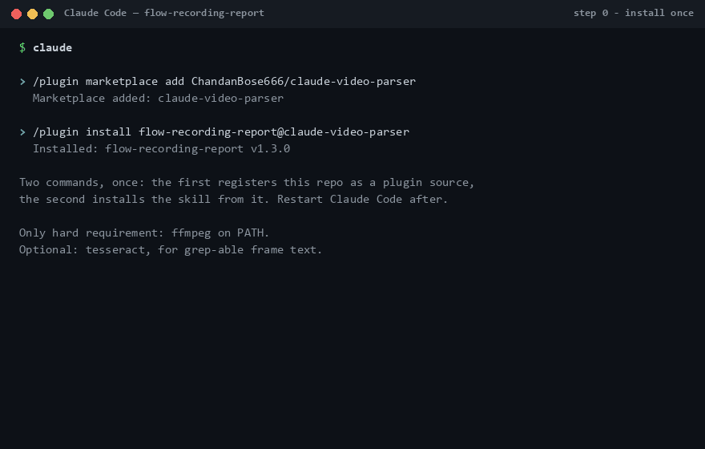
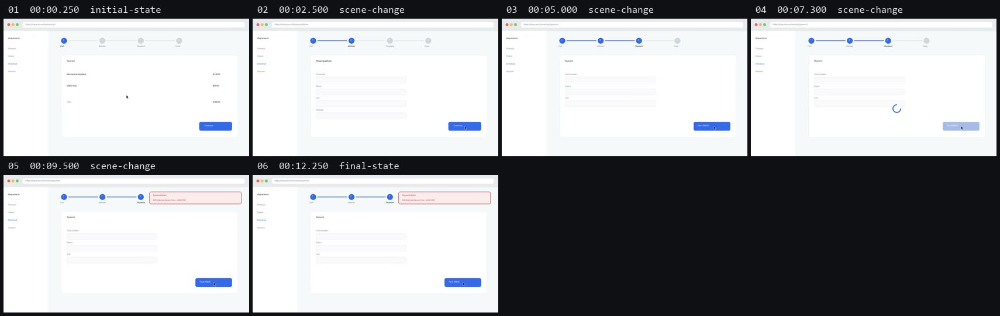

# claude-video-parser

**Hand Claude Code a screen recording of a broken UI flow. Get back an evidence-bounded
bug report** — which frame shows the failure, where the user clicked, what the error text
says, and an honest list of what the video *cannot* prove.



Claude has no native video input — so this skill turns the recording into a handful of
well-chosen keyframes (not 90 blind samples), reads one labelled contact sheet, and writes
a report where every claim is tagged observed / inferred / not-determinable.

## Quickstart

**1. Install the plugin** — inside Claude Code (CLI or IDE extension), run these two
commands once. The first registers this repo as a plugin source, the second installs the
skill from it:

```
/plugin marketplace add ChandanBose666/claude-video-parser
/plugin install claude-video-parser@claude-video-parser
```

Restart Claude Code. (Prefer a plain copy? `./scripts/install.sh` or
`.\scripts\install.ps1` puts the skill into `~/.claude/skills/` instead; `--project` /
`-Project` scopes it to the current repo.)

> **Upgrading from v1.3.0 or earlier?** The plugin and skill used to be named
> `flow-recording-report`; everything now shares one name so the catalog shows a single
> entry. Run `/plugin uninstall flow-recording-report@claude-video-parser` once, then
> install with the command above. If you used the copy scripts instead, delete the old
> `~/.claude/skills/flow-recording-report` folder and re-run the installer.

**2. Make sure ffmpeg is on PATH** — the only hard requirement:

| | |
|---|---|
| macOS | `brew install ffmpeg` |
| Debian/Ubuntu | `sudo apt install ffmpeg` |
| Windows | `winget install Gyan.FFmpeg` |

Optional but worth it: `tesseract` (`brew install tesseract` / `sudo apt install
tesseract-ocr` / `winget install UB-Mannheim.TesseractOCR`) — adds grep-able OCR text for
every extracted frame, so error strings are found before spending any visual tokens.

**3. Use it** — drag the video into the prompt (or type its path) and say what you expected:

> QA sent me this recording of checkout breaking — `./bug.mp4`. Expected: clicking Pay
> reaches the confirmation page.

Claude extracts keyframes, reads the contact sheet, and writes `BUG-REPORT.md`. That's the
whole workflow. You can also run the extractor directly:

```bash
python3 skills/claude-video-parser/scripts/extract_keyframes.py bug.mp4 -o ./out
python3 skills/claude-video-parser/scripts/extract_keyframes.py bug.mp4 --json   # machine-readable
```

## What you get

One contact sheet like this (every keyframe, labelled, ~1k visual tokens total — for most
bugs it is sufficient on its own):



...and a report ([full worked example](examples/BUG-REPORT.example.md)) whose claims look
like this:

```
[O] Payment failed / 500 Internal Server Error - ref 8c1f42     (frames 05-06)
[O] spinner present 00:07.3 -> 00:09.5 = 2.2s
[I] user clicked near (1087, 561) - the Pay button region (high confidence)
[?] actual HTTP status, console errors, whether it reproduces
```

`[O]` observed in a cited frame · `[I]` inferred · `[?]` not determinable from video. The
`[?]` section is deliberate: it tells the developer what to go collect, and it stops the
report being trusted further than pixels can support. A confident wrong bug report costs
more time than no report.

## When NOT to use it

The skill declines, on purpose, when a better artifact exists:

- **You can reproduce the bug locally** → drive the browser with Playwright MCP or Chrome
  DevTools MCP instead. The DOM, console, and network beat pixels on every axis.
- **A Playwright trace or HAR sits next to the video** → the extractor detects
  `trace.zip` / `*.har` / Cypress `screenshots/` siblings automatically and tells you to
  read those first. The video is the fallback, not the primary.

## How it works, and why it's cheap

**Scene thresholds calibrated for UI, not film.** ffmpeg's conventional scene threshold
(`0.3`) is tuned for hard cuts; measured UI transitions in real screen recordings score
**0.002–0.05** — a toast changes 4% of the frame. This extractor seeds at `0.0015`, then
applies temporal non-maximum suppression so a 400ms animation contributes one frame, not
twelve. On the bundled fixture: 6 frames, every transition captured, ~4,662 visual tokens
where naive 2fps sampling would burn ~19,425.

**Cursor/click inference.** For each transition, the seconds *before* it are scanned at
low resolution for a small travelling blob — a pointer — and the report can say "the user
clicked *here*". Validated against ground-truth clicks on real recordings: located clicks
land 1–49px off, with **zero wrong claims** — spinners, blinking carets, and typing are
recognised and never reported as a pointer. When evidence is weak it abstains rather than
guesses.

**Optional OCR.** With tesseract installed, every frame's text lands in the manifest
(frames are upscaled 2× first — the difference between missing and reading a 14px error
banner). Error strings become grep-able before any frame is viewed.

**Region-of-interest scoring.** A video player or animated canvas in the recording floods
scene detection. The extractor notices, locates the continuously-changing region, and
prints the exact `--roi` to retry with — measured on a real recording, that took 76
candidates down to 2 and still caught the bug at its exact timestamp.

**What it deliberately does not do:** audio, transcription, YouTube, MCP servers, API
keys, model downloads. Stdlib Python + ffmpeg. For per-segment variable-fps extraction or
audio, compose with [`claude-video-vision`](https://github.com/jordanrendric/claude-video-vision) —
that's a perception layer, this is a reporting contract, and they stack.

## Repo layout

| Path | What |
|---|---|
| `skills/claude-video-parser/` | The skill: SKILL.md, extractor script, evidence rules, report template |
| `examples/` | Worked example: demo GIF, contact sheet, full bug report |
| `tests/` | 79 checks across four suites + a real-recording validation harness (`tests/realworld/`) |
| `PROJECT-BRIEF.md` | Design decisions, their reasoning, and the cost of reversing them |

## Test

```bash
python3 -m pip install pillow
python3 tests/test_extract.py        # 34 end-to-end checks on a synthetic fixture
python3 tests/test_cursor_units.py   # 21 unit checks: cursor detection primitives
python3 tests/test_ocr_units.py      #  8 unit checks: OCR TSV parsing
python3 tests/test_misc_units.py     # 16 unit checks: ROI + artifact detection
```

CI runs all four on Ubuntu, macOS, and Windows (Python 3.10 and 3.12). The real-recording
harness (`tests/realworld/`, needs Playwright + network) records genuine browser flows
with ground-truth events and click coordinates, and scores the extractor against them.

## Licence

MIT
